<div align="center">

# 🛰️ Satellite Digital Twin using AI & Machine Learning

### Intelligent CubeSat Monitoring • Fault Prediction • Explainable AI


<br>


---

### 🚀 Samsung Innovation Campus (SIC) Project

AI Powered Digital Twin for Intelligent CubeSat Health Monitoring

</div>

---

# 📖 Overview

Satellite Digital Twin is an AI-powered monitoring platform developed for CubeSat systems. The application continuously analyzes telemetry data, predicts subsystem faults, estimates satellite health, and explains AI predictions using Explainable AI techniques.

The project combines modern web technologies with Machine Learning and Deep Learning to provide an interactive mission control dashboard capable of real-time monitoring, analytics, simulation, manual fault prediction, and security visualization.

---

# ✨ Features

- 🛰️ Live Telemetry Dashboard
- 🤖 AI Digital Twin
- 📊 Analytics Dashboard
- 🧠 XGBoost Fault Prediction
- 🤖 LSTM Deep Learning
- 🔍 SHAP Explainability
- 💡 LIME Explainability
- 📈 Satellite Health Score
- 📝 Manual Fault Prediction
- 🛰️ Digital Twin Simulation
- 🔒 Security Monitoring
- 📖 FastAPI Swagger API

---

# 📸 Project Preview

## 🛰 Dashboard

<p align="center">

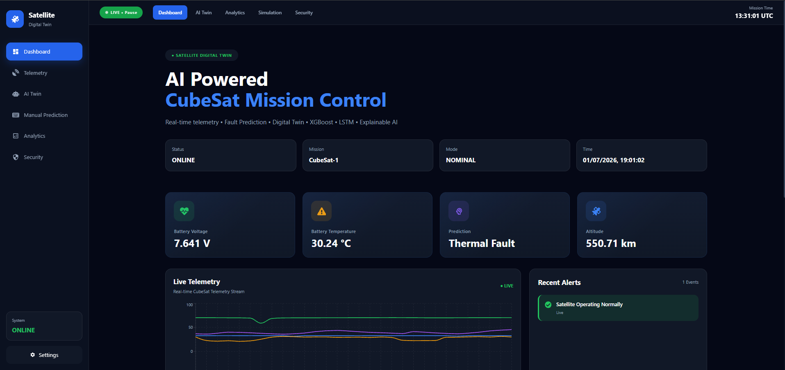

</p>

---

## 📡 Live Monitoring

<p align="center">

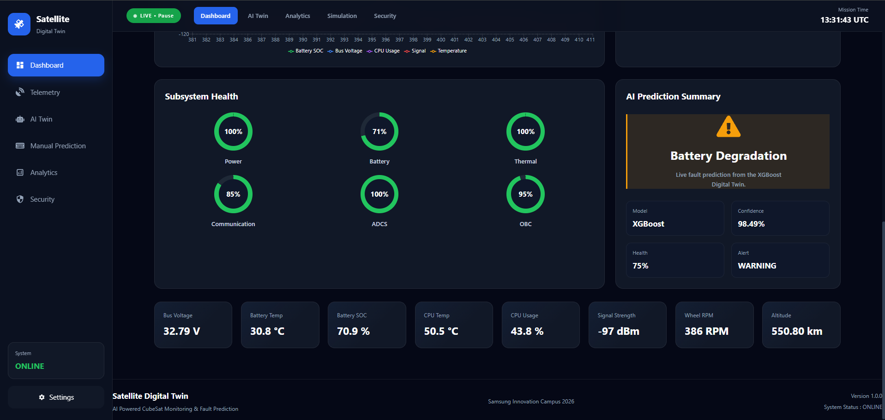

</p>

---

## 🤖 AI Digital Twin

<p align="center">

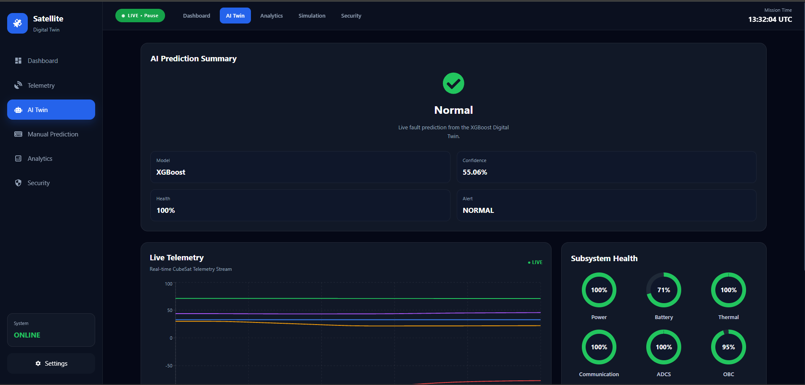

</p>

---

## 🛰 Digital Twin Simulation

<p align="center">

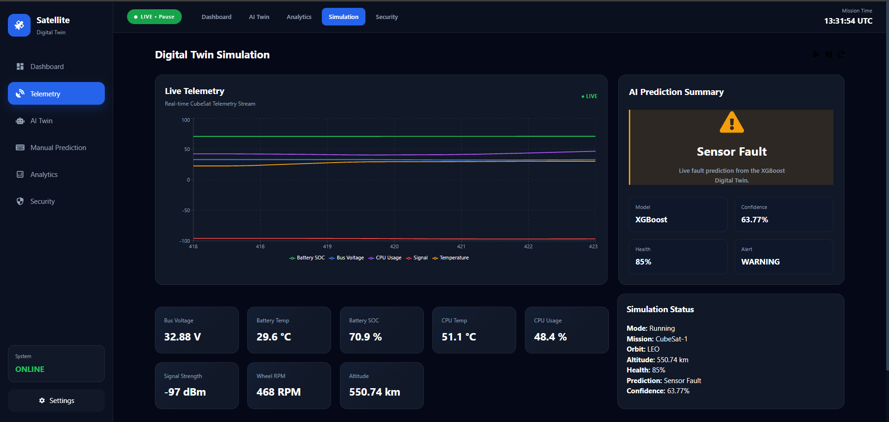

</p>

---

# 📸 Manual Fault Prediction

The Manual Prediction module allows users to manually enter telemetry values or generate predefined telemetry scenarios to evaluate the AI model.

---

## ✍️ Manual Telemetry Input

<p align="center">
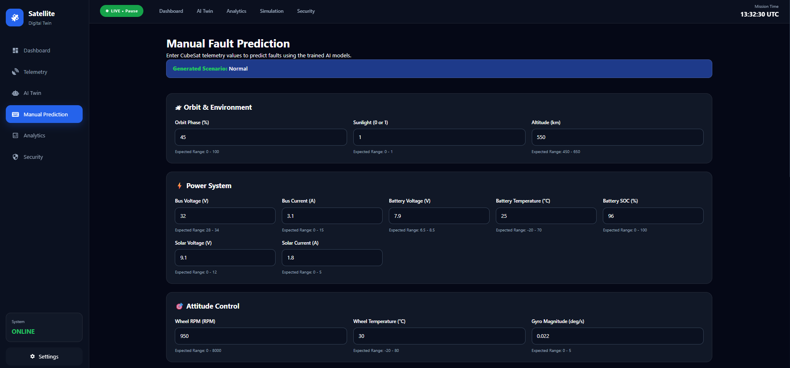
</p>

Users can manually enter CubeSat telemetry or generate sample scenarios for AI-powered fault prediction.

---

## ✅ Normal Telemetry Prediction

<p align="center">
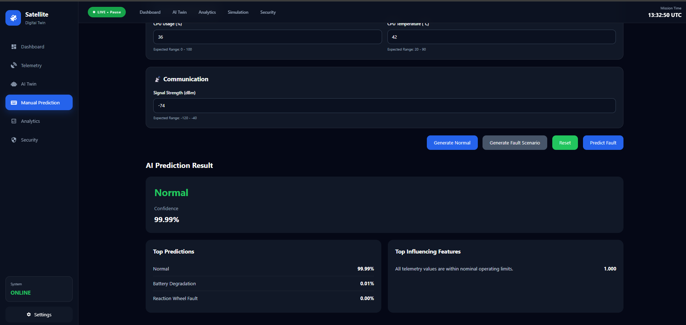
</p>

Demonstrates healthy telemetry prediction with confidence score and explainability.

---

## ⚠️ Fault Prediction

<p align="center">
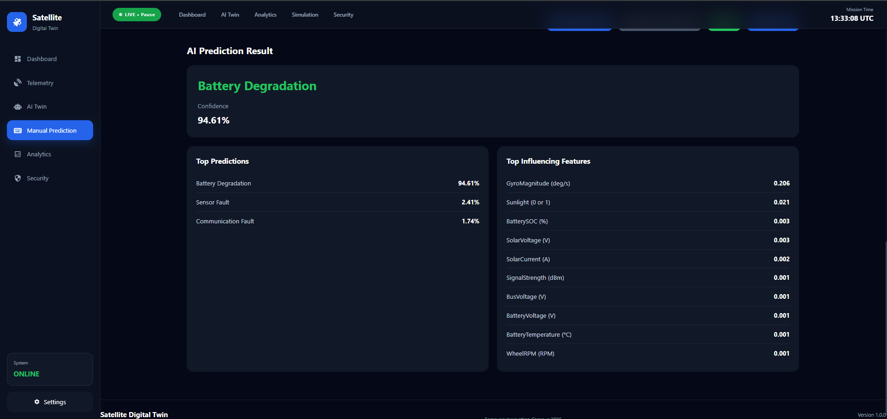
</p>

Example of AI detecting subsystem faults from telemetry data with confidence scores and feature importance.

---

# 📊 Analytics Dashboard

<p align="center">
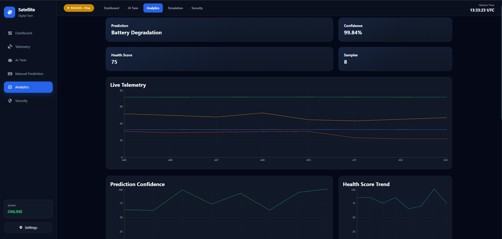
</p>

Real-time analytics including telemetry visualization, health score trends, prediction confidence, and fault statistics.

---

<p align="center">
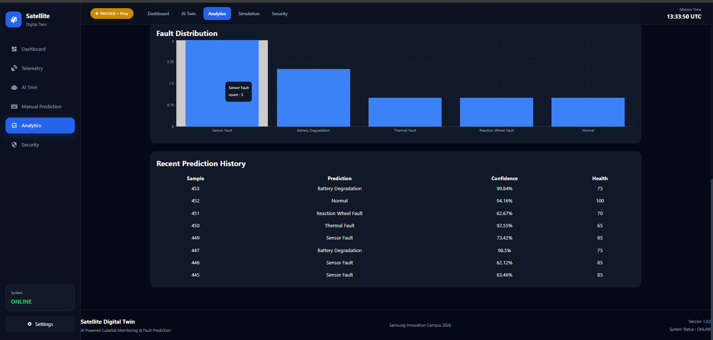
</p>

Historical telemetry records and AI prediction history for performance monitoring.

---

# 🔒 Security Center

<p align="center">
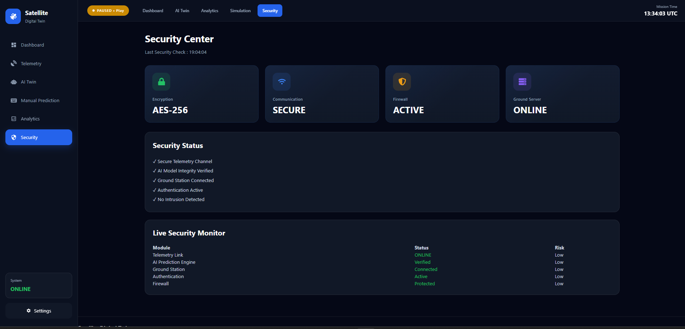
</p>

The Security Center monitors communication status, authentication, firewall status, encryption, and overall system integrity.

---

# 📖 REST API Documentation

<p align="center">
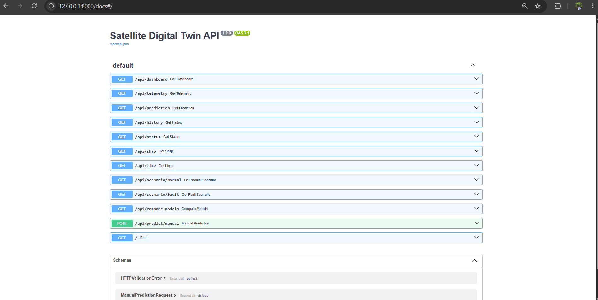
</p>

Interactive Swagger documentation automatically generated by FastAPI for testing and exploring REST API endpoints.

---

# 🚀 Project Highlights

✔ Real-Time CubeSat Telemetry Monitoring

✔ AI-Based Fault Detection using XGBoost

✔ Deep Learning Support using LSTM

✔ Explainable AI with SHAP & LIME

✔ Interactive Digital Twin Dashboard

✔ Manual Telemetry Fault Prediction

✔ Real-Time Simulation Environment

✔ Analytics Dashboard

✔ Security Monitoring

✔ RESTful API with Swagger Documentation

---

# 🏗️ System Architecture

The project follows a client-server architecture where the React frontend communicates with a FastAPI backend. The backend processes telemetry, performs AI-based fault prediction, and returns results to the dashboard.

```text
                CubeSat Telemetry
                       │
                       ▼
            Data Preprocessing
                       │
        ┌──────────────┴──────────────┐
        ▼                             ▼
   XGBoost Model                 LSTM Model
        │                             │
        └──────────────┬──────────────┘
                       ▼
             Fault Prediction Engine
                       │
               SHAP & LIME Analysis
                       │
                       ▼
                FastAPI REST API
                       │
                       ▼
              React Web Dashboard
```

---

# 📂 Project Structure

```text
SATELLITE-DIGITAL-TWIN
│
├── backend/
│   ├── config/
│   ├── datasets/
│   ├── deployment/
│   ├── notebooks/
│   ├── reports/
│   ├── saved_models/
│   ├── src/
│   └── requirements.txt
│
├── frontend/
│   ├── public/
│   ├── src/
│   │   ├── assets/
│   │   ├── components/
│   │   ├── context/
│   │   ├── hooks/
│   │   ├── layouts/
│   │   ├── pages/
│   │   ├── routes/
│   │   ├── services/
│   │   └── styles/
│   └── package.json
│
├── docs/
│   └── images/
│
├── LICENSE
└── README.md
```

---

# 📊 Dataset

The project uses a CubeSat telemetry dataset containing normal operating conditions and multiple fault scenarios.

### Features

| Category      | Example Parameters                      |
| ------------- | --------------------------------------- |
| Orbit         | Orbit Phase, Altitude, Sunlight         |
| Power         | Bus Voltage, Bus Current                |
| Battery       | Voltage, Temperature, State of Charge   |
| Solar Panel   | Voltage, Current                        |
| ADCS          | Wheel RPM, Wheel Temperature, Gyroscope |
| OBC           | CPU Usage, CPU Temperature              |
| Communication | Signal Strength                         |

### Fault Classes

- ✅ Normal
- 🔋 Battery Degradation
- ⚡ Power Anomaly
- 📡 Communication Fault
- 🎯 Reaction Wheel Fault
- 🌡 Thermal Fault
- 📈 Sensor Fault

---

# 🧠 Machine Learning Models

## XGBoost

- Primary classification model
- Multi-class fault prediction
- High prediction accuracy
- Confidence score generation

---

## LSTM

- Deep Learning sequence model
- Time-series telemetry analysis
- Future fault prediction support

---

# 🔍 Explainable AI

The project integrates Explainable AI techniques to improve prediction transparency.

### SHAP

- Global feature importance
- Overall model interpretation

### LIME

- Local explanation for each prediction
- Shows the telemetry features influencing the predicted fault

---

# 🛠️ Technology Stack

| Layer            | Technologies          |
| ---------------- | --------------------- |
| Frontend         | React, Vite           |
| Backend          | FastAPI, Uvicorn      |
| Machine Learning | XGBoost, Scikit-learn |
| Deep Learning    | TensorFlow, LSTM      |
| Explainability   | SHAP, LIME            |
| Charts           | Recharts              |
| Language         | Python, JavaScript    |

---

# ⚙️ Installation

## 1. Clone Repository

```bash
git clone https://github.com/<your-username>/Satellite-Digital-Twin.git
cd Satellite-Digital-Twin
```

---

## 2. Backend Setup

```bash
cd backend

python -m venv .venv
```

### Activate Environment

#### Windows

```bash
.venv\Scripts\activate
```

#### Linux / macOS

```bash
source .venv/bin/activate
```

### Install Dependencies

```bash
pip install -r requirements.txt
```

### Start Backend

```bash
uvicorn src.main:app --reload
```

Backend URL

```
http://127.0.0.1:8000
```

Swagger API

```
http://127.0.0.1:8000/docs
```

---

## 3. Frontend Setup

```bash
cd frontend
```

Install packages

```bash
npm install
```

Start development server

```bash
npm run dev
```

Frontend URL

```
http://localhost:5173
```

---

# 🚀 Application Workflow

1. CubeSat telemetry is received.
2. Telemetry is preprocessed.
3. AI models predict subsystem faults.
4. SHAP and LIME explain the prediction.
5. Backend exposes results through REST APIs.
6. React dashboard visualizes telemetry, predictions, analytics, simulation, and security status.

---

# 📖 API Overview

| Method | Endpoint              | Description             |
| ------ | --------------------- | ----------------------- |
| GET    | `/api/dashboard`      | Live dashboard data     |
| GET    | `/api/history`        | Prediction history      |
| GET    | `/api/status`         | System status           |
| GET    | `/api/shap`           | SHAP explanation        |
| GET    | `/api/lime`           | LIME explanation        |
| GET    | `/api/compare-models` | Compare AI models       |
| POST   | `/api/predict/manual` | Manual fault prediction |

---

# 🔮 Future Improvements

- Live IoT telemetry integration
- Cloud deployment
- Multi-satellite monitoring
- Predictive maintenance
- User authentication
- Alert notifications
- 3D satellite visualization
- Mobile dashboard support

---

# 👨‍💻 Team

**Samsung Innovation Campus (SIC)**
This project was developed as part of the **Samsung Innovation Campus (SIC)** program.

- **Suchendra A**
- **Syed Ahemed**
- **Vijay**

---

Project: **Satellite Digital Twin using AI & Machine Learning & Deep Learning**

---

# 📄 License

This project is licensed under the **MIT License**.
